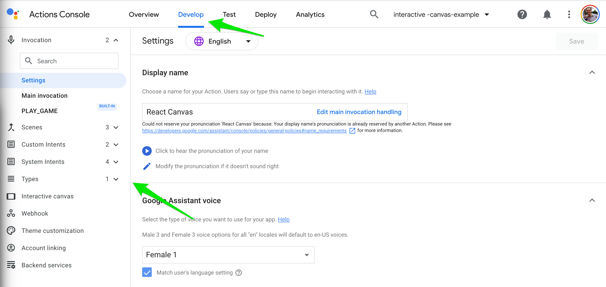
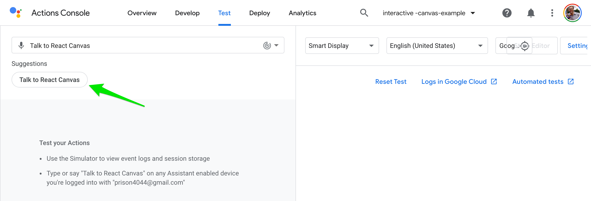

## Building and Running

This project was designed to run on Google's cloud using Cloud Functions
for Firebase (to run the webhook) and Firebase Hosting (to host the HTML file).
Since you need a Google Cloud project to run your Action, we'll be using the
same project.

This is meant as a quick example of how to get it running. While the following
are possible, I won't be going into details about:

* Running on a local machine while developing and testing
* Installing on a service besides Firebase (such as using AWS Lambda and S3)
* What is happening in each step

### Prerequisites

Make sure you have the project fully checked out from git and expanded.
You'll be doing some work via the command line and you should be in the
top-level directory of the project.

There are some files that you'll need to edit. Use the editor of your
choice, but I will be illustrating using IntelliJ Idea.

Make sure you have the following installed:

* A recent version of [node.js](https://nodejs.org/). This has been tested
  with node 12, but later versions should work. (I suggest using something
  like [nvm](https://github.com/nvm-sh/nvm) to install and manage what
  version of Node you use.)
* The latest [Firebase CLI tools](https://firebase.google.com/docs/functions/get-started#set-up-node.js-and-the-firebase-cli).
* Version 3 or higher of the [gactions](https://developers.google.com/assistant/actionssdk/gactions#install_the_gactions_command-line_tool)
  command line tool.

Some portions of Firebase require you to have billing enabled on a project,
although you should probably be well within the free tiers for all the work
that we're doing. You may wish to
[setup billing](https://cloud.google.com/billing/docs/how-to/manage-billing-account)
in advance.

### Building and Deploying

This may seem long, but the individual steps are pretty simple and
should be straightforward.

1.  Go to https://console.actions.google.com/ to create a new Action.

2.  Select the "new project" button.

    

3.  Enter a new project name and select "create project".

    
   
4.  Select that we want to build a game and click the "next" button

    
   
5.  Select to start with a "Blank project for smart display" and then
    "Start building". (We will actually be uploading a new configuration
    that covers this, but if you're starting from scratch, this is where
    you'd begin.)
   
    
   
6.  You'll be on the Actions Console Develop tab. We'll be updating
    the configuration using the `gactions` command-line tool. But we
    need some more information first.
   
7.  From the three-dot "hotdog" menu in the upper right corner, select the
    "Project settings".
   
    
   
8.  You will need the "Project ID" on this page. **Note**: This *may*
    be different than the "Project name". You need the ID.
   
    
   
9.  Using an editor, you will need to set this ID in 
    the `sdk/settings/settings.yaml` file for the `projectId` attribute.
    
    

10. We will also setup Firebase to use this project for Cloud Functions for
    Firebase and Firebase Hosting.
    
    At a command line, run `firebase init`

    

11. Use the arrow keys to move down to, and then the space bar to select,
    the "Functions" and "Hosting" items. Press Enter when you've selected both.
    
    

12. To associate it with our project, we'll "Use an existing project".
    Make sure this option is selected (or use the arrow keys to go to it)
    and press Enter.
    
    

13. Select your project with the arrow keys (if you have a lot, they will
    scroll). Both the name and ID will be shown. Press Enter.

    

14. Select JavaScript by pressing Enter, and then Enter again to not use ESLint

    

15. Select No (by pressing Enter) when it prompts if you want to overwrite
    `functions/package.json`, `function/index.js`, or `functions/.gitignore`.

    

16. Install the npm dependencies for the webhook by pressing Enter.

    

17. React compiles its files to the "build" directory, so we need to change
    the source of the files to be hosted to "build".
    
    

    You can then select the defaults (No) for single page and deploying
    from GitHub.
    
18. The `firebase init` command clobbers the `firebase.json` configuration
    file that was included with the project. You should either restore this
    from git or add the following attribute to the "hosting" configuration.
    
    ```javascript
    "rewrites":[
      {
        "source": "/webhook",
        "function": "webhook"
      }
    ]
    ```

    (Make sure the JSON syntax is correct, this may require adding a comma after
    the value before where you add this.)
    
    

19. Install the npm dependencies that are used by the web page by running the
    `npm install` command.
    
20. Build the React webapp with the `npm run build` command.

21. Deploy both the webhook and the React webapp to Firebase Hosting using
    the `firebase deploy` command.
    
    This can take a while, and may warn you that you need to setup billing
    on the Blaze plan if you haven't done so before. If it does prompt this,
    follow the URL provided to setup billing and then re-run `firebase deploy`.
    
    Once it deploys, it will provide the Hosting URL. You will need this
    for the next step.
    
    

22. Edit the `sdk/webhooks/ActionsOnGoogleFulfillment.yaml` file to change
    the `baseUrl` value for the webhook to use the same hosting URL from
    the previous step with the `webhook` path appended to it.
    
    

23. You may need to login and authorize access to your Actions on Google
    project with the `gactions login` command, which will open up a window
    in the browser.
    
    You should log in using the same account you created the Action with
    and authorize access to your Actions.

24. Deploy the Action configuration to Actions Builder. On the command line,
    change directories to `sdk` and run `gactions push`.
    
    There may be a number of warnings about things you'll need to set later,
    but it will still deploy ok for now.
    
    

### Testing

On the Actions console, refresh the Develop tab to make sure updates have been
applied. You should see that there are now new scenes, Custom Intents, and Types
listed on the left.



If you check the Webhook nagivation, you should see the webhook URL you set.


Then you can navigate to the Test tab. It will enable the preview to work
through this test tool or through any Google Assistant Smart Displays attached
to the same account.


These steps can either be done using your voice on a Smart Display using the
same account, using your voice with the microphone in the simulator, or
via keyboard and mouse in the simulator.

1.  You can then either say "Hey Google, Talk to react canvas" to a Smart Display
    attached to the same account, or click on the "Talk to React Canvas" button
    to begin testing.

    

2.  The Action will be invoked, will audibly welcome us, and load the 
    webapp. Once loaded, the webapp will switch to the "welcome" scene.
    
    

3.  If we say "colors", we'll be prompted for what color we want to see.

    

4.  If we say a color such as "red", our Action will reply with some witty
    comment about the color and prompt us if we want another color, or if we
    would like to talk about numbers instead. There will also be a spinner
    drawn in the color we said. We'll also see some buttons under the spinner.
    
    

5.  We can then click one of the buttons, such as the "Blue" button, and the
    Assistant will treat it as if we had said "blue".
    
    

6.  We can then switch to talking about numbers by asking for those instead,
    and we'll be prompted for what number we want.
    
7.  If we respond with a number, it will audibly count from 1 to that number,
    and add an item to the bulleted list when it says that number.
    
    

### After updating

If you make changes, you'll need to take some steps to re-build and/or redeploy.

#### If you edit the React app:

1. Rebuild with `npm run build`
2. Redeploy with `firebase deploy --only hosting`

#### If you edit the webhook:

1. Redeploy with `firebase deploy --only functions`

#### Updating Actions Builder

If you change the scenes, intents, types, or other configurations in the 
Actions Builder using the web, you don't need to make any changes but you may 
wish to update your local copy of the configuration:

1. Change to the "sdk" directory
2. Download with `gactions pull`

#### Updating Actions Builder pulled files

If, instead, you make those configuration changes using the files under `sdk`,
you need to send them to Google and enable the preview version of them:

1. Change to the "sdk" directory
2. Redeploy with `gactions push`
3. Enable these versions for preview by switching (or reloading) the "Testing"
   tab or running `gactions deploy preview`


